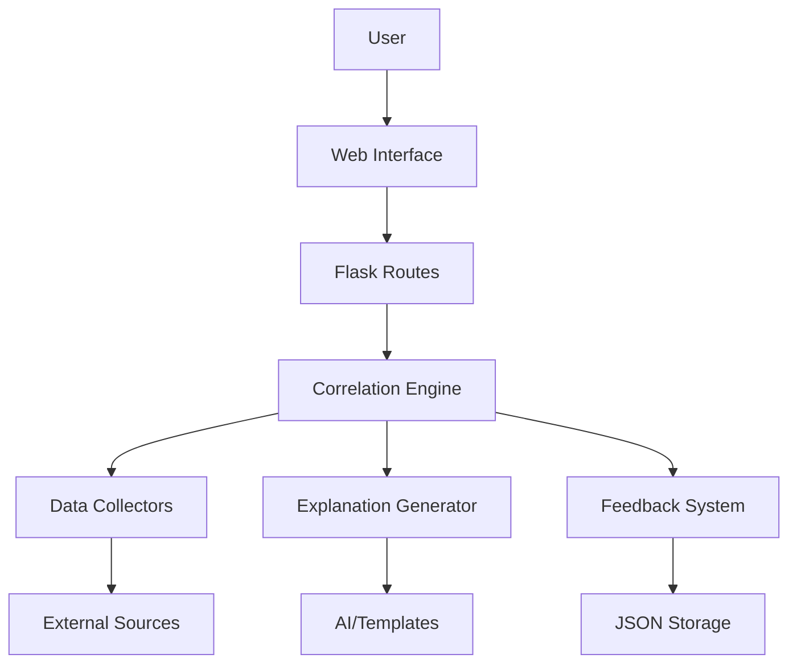

# 🛠️ Development Guide - Chartastrophe

## 📋 Table of Contents

1. [Project Architecture](#project-architecture)
2. [Configuration](#configuration)
3. [Local Development](#local-development)
4. [Module Structure](#module-structure)
5. [API and Endpoints](#api-and-endpoints)
6. [Testing](#testing)
7. [Deployment](#deployment)
8. [Best Practices](#best-practices)

## 🏗️ Project Architecture

### Folder Structure

```
chartastrophe/
├── src/                          # Main source code
│   ├── web/                      # Flask web interface
│   │   ├── app.py               # Application factory
│   │   ├── routes.py            # Routes and API endpoints
│   │   ├── templates/           # HTML templates
│   │   └── static/              # Static files (CSS, JS)
│   ├── collectors/              # Data collectors
│   │   ├── real_data_collector.py      # Main collector
│   │   ├── open_data_sources.py        # Open data sources
│   │   └── data_sources_registry.py    # Source registry
│   ├── correlation/             # Correlation engine
│   │   ├── correlation_engine.py       # Statistical calculations
│   │   └── correlation_analyzer.py     # Data analysis
│   ├── generator/               # Explanation generator
│   │   └── explanation_generator.py    # AI for explanations
│   ├── feedback/                # Feedback system
│   │   └── user_feedback.py     # Feedback management
│   └── config.py                # Centralized configuration
├── tests/                       # Unit and integration tests
├── data/                        # Temporary data and cache
├── requirements.txt             # Python dependencies
├── wsgi.py                     # Application entry point
├── logging.conf                # Logging configuration
├── env.example                 # Environment variables example
└── README.md                   # User documentation
```

### Data Flow



## ⚙️ Configuration

### Environment Variables

Copy `env.example` to `.env` and modify according to your needs:

```bash
cp env.example .env
```

### Centralized Configuration

All configuration is centralized in `src/config.py`:

- `CORRELATION_CONFIG`: Statistical parameters
- `DATA_CONFIG`: Data generation
- `SECURITY_CONFIG`: Security and rate limiting
- `PERFORMANCE_CONFIG`: Optimizations
- `FLASK_CONFIG`: Flask configuration
- `API_CONFIG`: External APIs

## 🚀 Local Development

### Installation

```bash
# Clone the project
git clone <repository-url>
cd chartastrophe

# Create virtual environment
python -m venv venv_new
source venv_new/bin/activate  # Linux/Mac
# or
venv_new\Scripts\activate     # Windows

# Install dependencies
pip install -r requirements.txt
```

### Launch

```bash
# Development mode
python wsgi.py

# With custom environment variables
FLASK_DEBUG=True HOST=0.0.0.0 PORT=8000 python wsgi.py
```

### Hot Reload

The development server supports automatic hot reload when `FLASK_DEBUG=True`.

## 📦 Module Structure

### 🌐 Web Module (`src/web/`)

- **`app.py`**: Factory pattern to create Flask application
- **`routes.py`**: Route and API endpoint definitions
- **`templates/`**: Jinja2 templates for interface
- **`static/`**: Static assets (CSS, JS, images)

### 📊 Collectors Module (`src/collectors/`)

- **`real_data_collector.py`**: Main collector with 1000+ sources
- **`open_data_sources.py`**: Open data sources
- **`data_sources_registry.py`**: Source registry and management

### 🔬 Correlation Module (`src/correlation/`)

- **`correlation_engine.py`**: Main correlation calculation engine
- **`correlation_analyzer.py`**: Advanced statistical analysis

### 🤖 Generator Module (`src/generator/`)

- **`explanation_generator.py`**: AI explanation generation

### 💬 Feedback Module (`src/feedback/`)

- **`user_feedback.py`**: User feedback system

## 🔌 API and Endpoints

### Main Endpoints

| Endpoint | Method | Description |
|----------|---------|-------------|
| `/` | GET | Home page |
| `/api/correlation/random` | GET | Generate random correlation |
| `/api/correlation/graph/<id>` | GET | Graph data for correlation |
| `/api/feedback` | POST | Submit user feedback |
| `/api/feedback/stats` | GET | Feedback statistics |
| `/share/<id>` | GET | Correlation sharing page |

### API Response Format

```json
{
  "status": "success|error",
  "data": {
    "correlation": 0.85,
    "correlation_id": "uuid",
    "series1_name": "Dataset 1",
    "series2_name": "Dataset 2",
    "explanation": "Generated explanation...",
    "sources": [...]
  },
  "message": "Error message if applicable"
}
```

## 🧪 Testing

### Test Structure

```
tests/
├── unit/                    # Unit tests
├── integration/             # Integration tests
├── fixtures/                # Test data
└── conftest.py             # Pytest configuration
```

### Running Tests

```bash
# All tests
pytest

# Tests with coverage
pytest --cov=src

# Specific tests
pytest tests/unit/test_correlation_engine.py
```

## 🚀 Deployment

### Production

1. **Environment variables**:
   ```bash
   FLASK_ENV=production
   FLASK_DEBUG=False
   SECRET_KEY=your-production-secret-key
   ```

2. **WSGI Server**:
   ```bash
   gunicorn --bind 0.0.0.0:8000 wsgi:app
   ```

3. **Reverse Proxy** (Nginx):
   ```nginx
   location / {
       proxy_pass http://127.0.0.1:8000;
       proxy_set_header Host $host;
       proxy_set_header X-Real-IP $remote_addr;
   }
   ```

### Docker

```dockerfile
FROM python:3.9-slim
WORKDIR /app
COPY requirements.txt .
RUN pip install -r requirements.txt
COPY . .
EXPOSE 5000
CMD ["python", "wsgi.py"]
```

## 📋 Best Practices

### Code Style

- **PEP 8**: Follow Python conventions
- **Type Hints**: Use type annotations
- **Docstrings**: Document functions and classes
- **Logging**: Use centralized logging system

### Security

- **Rate Limiting**: Implemented on all API endpoints
- **Validation**: Input validation
- **CORS**: Proper configuration for allowed origins
- **Secrets**: Use environment variables

### Performance

- **Cache**: Caching generated correlations
- **Lazy Loading**: Lazy loading of data
- **Compression**: HTTP response compression
- **Monitoring**: Detailed logging for monitoring

### Maintenance

- **Configuration**: Centralized in `config.py`
- **Logging**: Structured and configurable
- **Documentation**: Kept up-to-date
- **Testing**: High coverage and automated tests

## 🐛 Debugging

### Logs

```bash
# Real-time logs
tail -f chartastrophe.log

# Only error logs
tail -f chartastrophe_errors.log
```

### Debug Mode

```bash
FLASK_DEBUG=True python wsgi.py
```

### Profiling

```python
from flask import g
import time

@app.before_request
def before_request():
    g.start_time = time.time()

@app.after_request
def after_request(response):
    diff = time.time() - g.start_time
    logger.info(f"Request took {diff:.3f}s")
    return response
```

## 🤝 Contribution

1. **Fork** the project
2. **Create** a feature branch (`git checkout -b feature/amazing-feature`)
3. **Commit** changes (`git commit -m 'Add amazing feature'`)
4. **Push** to branch (`git push origin feature/amazing-feature`)
5. **Open** a Pull Request

---

*For more information, see the [README.md](README.md) main file.* 